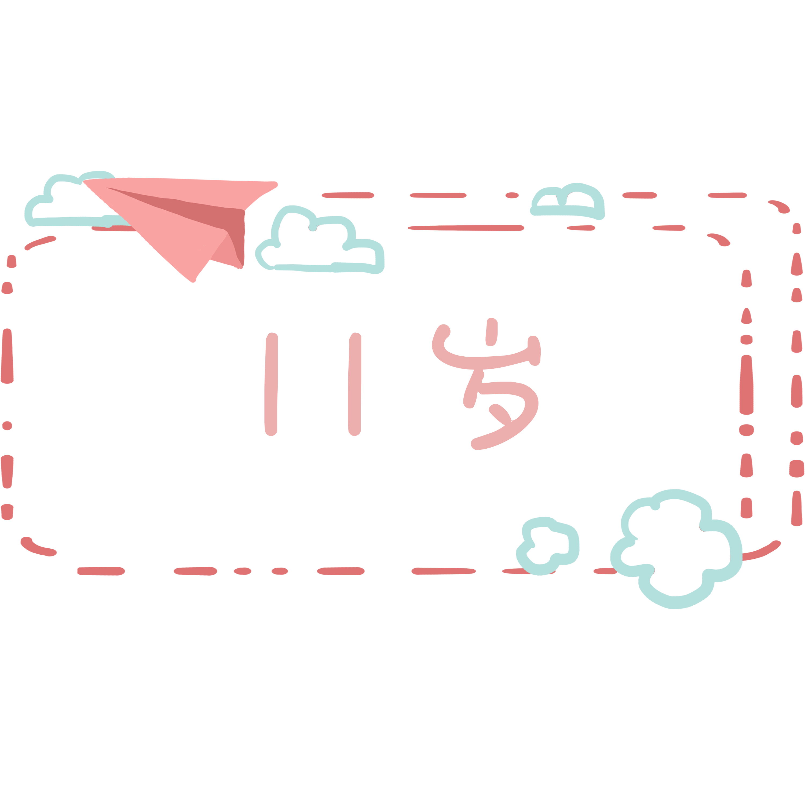

欢迎来到我的个人网页😄
我先来介绍一下自己吧  
我是  
  
我今年
  
我的生日是
  
我的老家在
  

我目前是强棒基地的一名棒球运动员。
> 想知道什么是棒球基地？ 请继续浏览下面的网页吧~
没有哪家公司的文化具有完美的接纳性和包容性，但有的地方的人有兴趣通过提升自己来改善文化。在Amplitude，我们经常谈论分析中的 "a-ha！"时刻--当你发现鼓励人们保留的神奇因素时。我的 "a-ha！"时刻更多的是一系列的意识--在接下来的几周里，我将亲眼看到这样一家年轻的公司是如何在处理诸如多样性和文化等困难的问题时仍能做到深思熟虑的。  

首先是实际的面试。我把它当作是我采访公司的机会，也当作是他们采访我的机会。我问了一些关于文化和透明度的困难问题，并根据一个晴雨表来衡量他们的回答，从企业的双关语到公然的诚实。我发现我未来的同事们的回答在透明度方面是有分寸的，也是经过深思熟虑的，高度反映了他们对我的尊重。那一刻我知道，我找到了一个可以表达自己的地方，这里的人完全致力于他们的核心价值观，即使管理层误入歧途，他们也不会  

> 我问了一些关于文化和透明度的问题，并根据一个晴雨表来衡量他们的回答，从企业的双关语到公然的诚实。  

当我收到Amplitude的欢迎礼物时，其中包括一个Neko Atsume杯子和一本Persona 3艺术书，我哭了。我哭是因为自己内心深处那个收集不同指甲油却从不涂指甲油上学前班的小女孩，为那个为了午餐时能和男生坐在一起而假装不喜欢男生的少女，为那个不敢为自己的智力感到骄傲的大学生。我哭了，因为我觉得第一次我身边的人不仅会接受我是谁，而且还会赞美那些让我独一无二的矛盾。我哭是因为我真的非常喜欢这两款游戏，而且每天都会和那些接受我的人一起度过美好的时光。  

  

在我加入Amplitude几周后，我和我的团队参加了一个JavaScript见面会，讨论React的最佳实践，React是我们应用的前端框架。在这次见面会上，大约有50人参加。我立刻注意到观众席上只有一个女性面孔。  
"我是这里唯一的另一个女孩，"我紧张地对我的一个同事低声说。  
"嗯，我很高兴你在这里，"他说。    
我笑了笑。"我也是。"    
我不希望自己生而为男人了，我也不为我鲜艳的开衫或我的观点感到羞耻。  
但还是很难回忆起什么时候被这么多的原始天赋和智慧环绕，我到目前的高度是因为我像个女孩一样编程，因为我像第一代中国移民一样编程，因为我像一个伴随着后街男孩和哈利波特长大的人一样编程。因为我的观点和见解是有价值的，因为我有幸积累了不同的经验。  
这些都是我像一个Ampliteer一样编程的原因。    

* 注："Ampliteer "是我们称呼Amplitude团队成员的几种方式之一。  

  

### 我在哈利波特世界实现了我所有的梦想！! (ノ◕ヮ◕)ノ*:・ﾟ✧  

#### References
图片来源: CodingGirlsClub 公众号 

  
