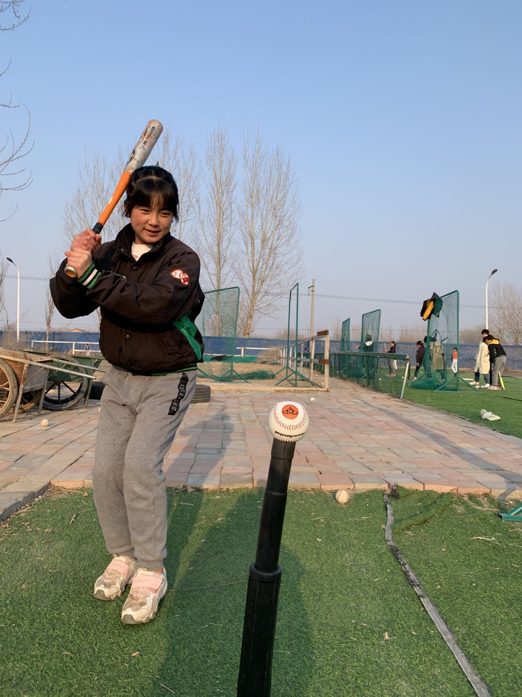
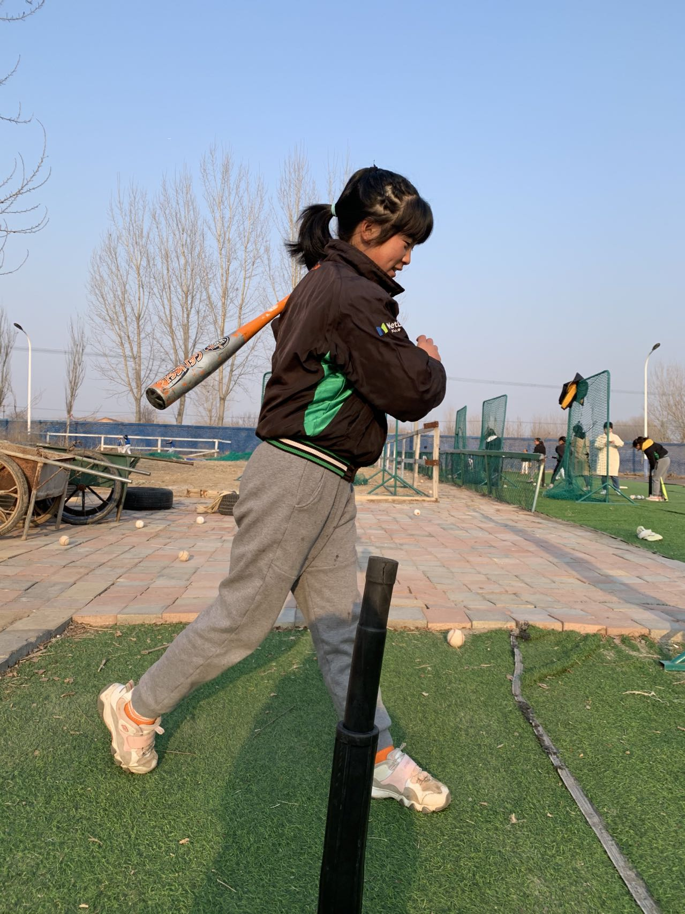

*Q: 平时的兴趣爱好有哪些？*  
喜欢画画，喜欢浅色，最喜欢粉色，但是浅蓝色，浅绿色，浅紫色都喜欢  
喜欢看书，喜欢诗人，喜欢李白的静夜思，喜欢苏轼的水调歌头  

*Q：什么时候开始学习棒球的？*  
五个月前来的，就开始学习，忘记了自己是什么时候学会棒球的规则，可能是一周，也可能是一个月，反应过来的时候已经学会了  

*Q：每天的棒球训练时长是多久？*  
每天都要训练3个小时以上，如果要练习挥棒，每次大概练习300下  

*Q：在棒球基地的一天是如何度过的，每天做喜欢做的事情？*  
棒球基地有时间表，精准到每一个小时要做什么，喜欢打羽毛球  

*Q：棒球学习过程中遇到过什么困难或问题？是如何克服这些问题的？*  
天气很冷，手上会有冻疮，打棒球手也会磨出茧然后破掉。后来就习惯了。  
